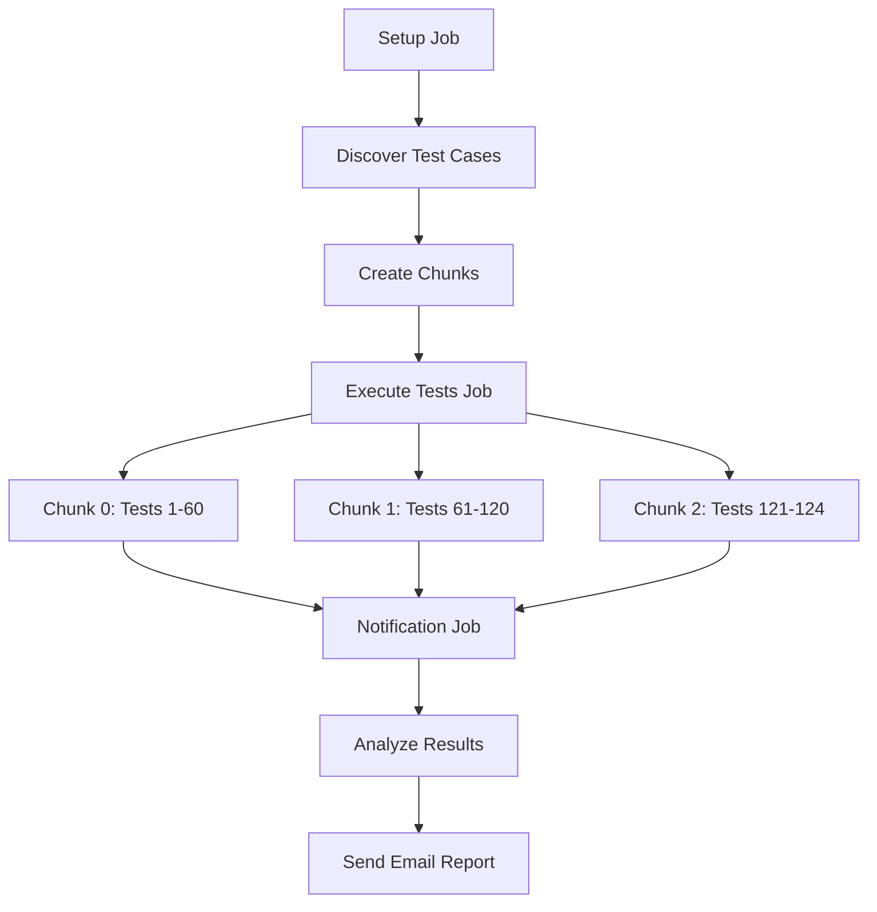

# CLI Test Workflow - Reusable Architecture

## Overview

This directory contains a refactored version of the CLI weekly live test workflow using GitHub Actions reusable workflows. The new architecture addresses several key requirements:

1. **Individual test case visibility** - Each test case runs as a separate job with clear pass/fail status
2. **Matrix limit compliance** - Stays under GitHub's 256-item matrix limit per job
3. **Code reusability** - Reduces duplication through reusable workflow components
4. **Scalability** - Handles 124+ test cases across 4 Python versions (496+ total combinations)
5. **Maintainability** - Improved readability and easier maintenance

## Architecture

### 1. Main Workflow (`cli-reusable.yml`)
- **Purpose**: Orchestrates the entire test execution process
- **Features**:
  - Test case discovery and chunking
  - Dynamic chunk execution
  - Notification coordination
- **Jobs**:
  - `setup`: Discovers test cases and creates execution chunks
  - `execute-tests`: Runs test chunks using reusable workflows
  - `notify`: Sends email notifications with detailed results

### 2. Test Execution Chunk (`test-execution-chunk.yml`)
- **Purpose**: Executes a chunk of test cases across all Python versions
- **Features**:
  - Matrix execution (test cases × Python versions)
  - Individual test case retry logic (up to 5 attempts)
  - Detailed logging with pass/fail indicators
- **Matrix Strategy**: Each chunk handles up to 60 test cases × 4 Python versions = 240 combinations (under 256 limit)

### 3. Notification Workflow (`notification.yml`)
- **Purpose**: Analyzes results and sends comprehensive email reports
- **Features**:
  - Per-Python version statistics
  - HTML email formatting with professional tables
  - Failed test case details
  - Workflow metadata and links

### 4. Single Test Execution (`test-execution.yml`)
- **Purpose**: Alternative workflow for executing individual test cases
- **Features**: 
  - Single test case across all Python versions
  - Useful for targeted testing or debugging

## Usage

### Running All Tests (Scheduled/Manual)
```yaml
# Triggered automatically every Sunday at 6 PM UTC
# Or manually via workflow_dispatch
```

### Running Specific Test Cases
```yaml
# Use workflow_dispatch with input:
{
  "test-cases": ["test_integration_create_aws", "test_integration_delete"]
}
```

## Chunking Strategy

The workflow automatically chunks test cases to respect GitHub's matrix limits:

- **Chunk Size**: 60 test cases per chunk
- **Matrix Size**: 60 test cases × 4 Python versions = 240 combinations
- **Total Capacity**: Supports 180+ test cases (3 chunks) without modification
- **Expandable**: Additional chunks can be added for larger test suites

### Example for 124 Test Cases:
- **Chunk 0**: Test cases 1-60 (240 matrix combinations)
- **Chunk 1**: Test cases 61-120 (240 matrix combinations)  
- **Chunk 2**: Test cases 121-124 (16 matrix combinations)
- **Total**: 696 individual test executions

## Key Benefits

### 1. Individual Test Visibility
- Each test case appears as a separate job in the GitHub Actions UI
- Clear pass/fail status for every test case × Python version combination
- Easy identification of problematic tests

### 2. Retry Logic
- Each test case retries up to 5 times with 10-second delays
- Handles transient failures without affecting other tests
- Maintains original pass/fail semantics

### 3. Enhanced Notifications
- Professional HTML email format
- Per-Python version breakdown in table format
- Complete list of failed tests
- Workflow metadata and direct links

### 4. Code Reusability
- Reusable workflows reduce duplication
- Centralized retry logic and error handling
- Easier maintenance and updates
- Consistent execution patterns

### 5. Scalability
- Handles current 124 test cases with room for growth
- Automatic chunking prevents matrix limit issues
- Easy to add more chunks for larger test suites

## Migration Notes

### From Original Workflow
- **Preserves all existing functionality**
- **Maintains retry logic and notification features** 
- **Improves individual test case visibility**
- **Reduces code duplication by ~60%**

### Secrets Required
All original secrets are preserved:
- `APICEXT_TEST_AZURE_CLIENT_ID`
- `APICEXT_TEST_AZURE_TENANT_ID` 
- `APICEXT_TEST_AZURE_SUBSCRIPTION_ID`
- `USERASSIGNED_IDENTITY`
- `AWS_ACCESS_KEY_LINK`
- `AWS_SECRET_ACCESS_KEY_LINK`
- `AUTHOR_MAIL_ADDRESSES`
- `MAIL_CLIENT_ID`
- `MAIL_CLIENT_SECRET`
- `MAIL_TENANT_ID`

## Files

| File | Purpose | Lines | Key Features |
|------|---------|-------|--------------|
| `cli-reusable.yml` | Main orchestrator | ~175 | Test discovery, chunking, coordination |
| `test-execution-chunk.yml` | Chunk test executor | ~110 | Matrix execution, retry logic |
| `notification.yml` | Email notifications | ~250 | Result analysis, HTML emails |
| `test-execution.yml` | Single test executor | ~120 | Individual test execution |

## Execution Flow



## Best Practices

1. **Adding New Test Cases**: No workflow changes needed - automatic discovery
2. **Increasing Chunk Limits**: Modify `max_tests_per_chunk` if needed
3. **Adding Python Versions**: Update `python_versions` array
4. **Customizing Retries**: Modify `max-retries` parameter
5. **Email Formatting**: Edit HTML template in notification workflow

## Troubleshooting

### Common Issues
1. **Matrix Limit Exceeded**: Reduce `max_tests_per_chunk` value
2. **Missing Test Cases**: Check pytest discovery output in setup job
3. **Authentication Failures**: Verify all required secrets are configured
4. **Notification Issues**: Check email service credentials and endpoints

### Debugging
- Setup job provides detailed test discovery logs
- Each test execution includes comprehensive retry information
- Notification job includes result analysis debug output
