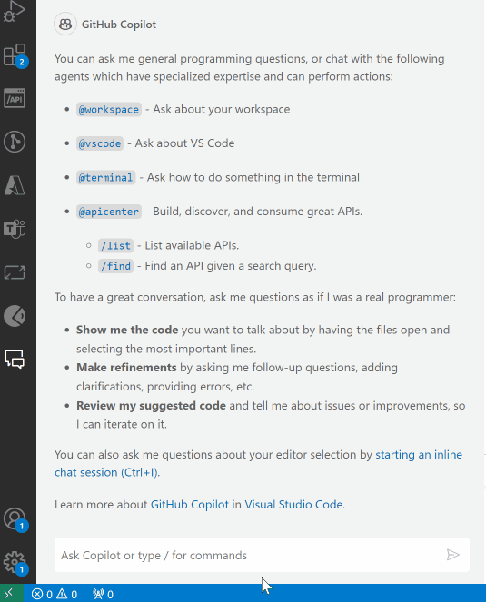

# Azure API Center for Visual Studio Code

Build, discover, try, and consume APIs using your favorite development environment

### Discover

Find the right API, fast from your organization's hand-crafted API catalog with API Center.

Try our new integration with GitHub Copilot Chat to find APIs based on semantic search query.

### Explore

Explore APIs without leaving Visual Studio Code with inline API documentation and interactive 'try it' experience.

Explore API requests and responses with automated .http file generation powered by the [REST Client extension for Visual Studio Code](https://marketplace.visualstudio.com/items?itemName=humao.rest-client).

### Consume

Generate API SDK clients for your favorite language including JavaScript, TypeScript, .NET, Python, Java, and more, powered by the same [Microsoft Kiota](https://learn.microsoft.com/en-us/openapi/kiota/overview) engine that generates SDKs for Microsoft Graph, GitHub, and more.

## Notice/Known Issues

- VS Code Insiders (version after 2024-01-19) is required to use the `@apicenter` agent with GitHub Copilot Chat.
- Contents in VS Code workspace are not send to GitHub Copilot.
- When the content of single spec is very large, `@apicenter` agent may fail as it reach token limit of GitHub Copilot LLM.
- When selected Azure Subscriptions is over 10 (or more), `@apicenter` agent may fail as it reach call limit of Azure REST APIs.

## Telemetry

VS Code collects usage data and sends it to Microsoft to help improve our products and services. Read our [privacy statement](https://go.microsoft.com/fwlink/?LinkID=528096&clcid=0x409) to learn more. If you don’t wish to send usage data to Microsoft, you can set the `telemetry.enableTelemetry` setting to `false`. Learn more in our [FAQ](https://code.visualstudio.com/docs/supporting/faq#_how-to-disable-telemetry-reporting).
