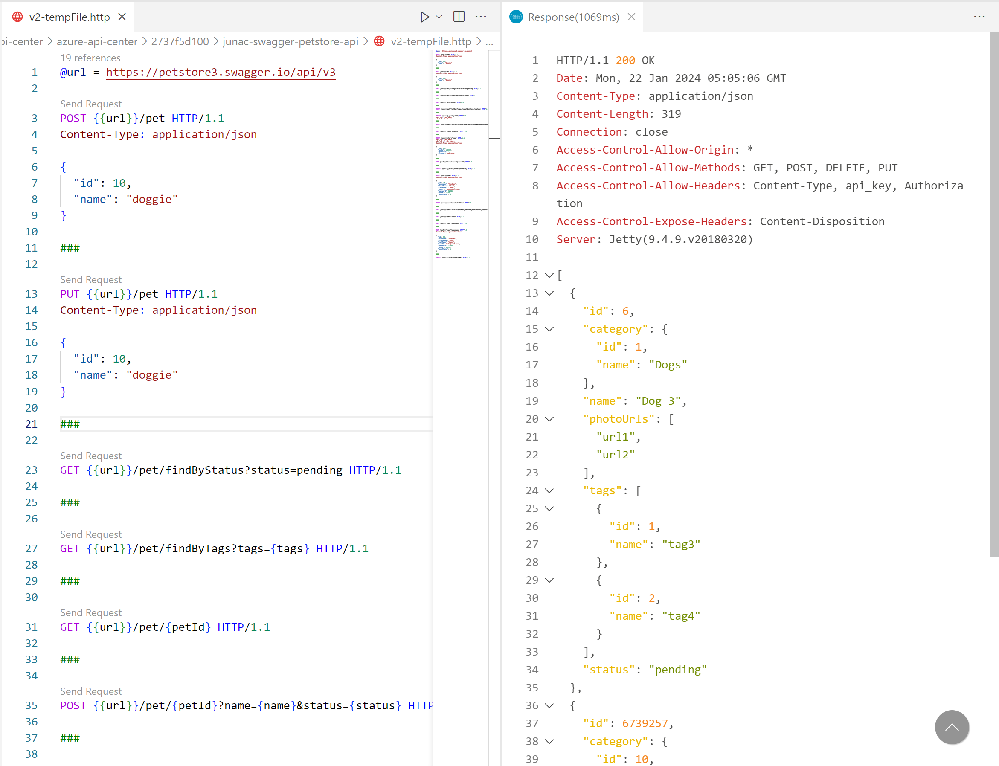

# Azure API Center for Visual Studio Code

Build, discover, try, and consume APIs using your favorite development environment.

### Build

Make APIs you are building discoverable to others by registering them with API Center directly or using CI/CD pipelines in GitHub or Azure DevOps.

Shift-left API design conformance checks into Visual Studio Code with integrated linting support, powered by Spectral.

Ensure that new API versions don't break API consumers with breaking change detection support, powered by Optic.

### Discover

Find the right API, fast from your organization's hand-crafted API catalog with API Center.

Try our new integration with GitHub Copilot Chat to find APIs based on semantic search query.

### Explore

Explore APIs without leaving Visual Studio Code with inline API documentation and interactive 'try it' experience.

Explore API requests and responses with automated .http file generation powered by the [REST Client extension for Visual Studio Code](https://marketplace.visualstudio.com/items?itemName=humao.rest-client).

### Consume

Generate API SDK clients for your favorite language including JavaScript, TypeScript, .NET, Python, Java, and more, powered by the same [Microsoft Kiota](https://learn.microsoft.com/en-us/openapi/kiota/overview) engine that generates SDKs for Microsoft Graph, GitHub, and more.

## Notice/Known Issues

- Contents in VS Code workspace are not sent to GitHub Copilot.
- When the content of single spec is very large, the `@apicenter` agent may fail as the token limit of GitHub Copilot Chat is exceeded. This is a temporary limitation our team is working to remove.
- When the number of selected Azure Subscription is larger then 10, `@apicenter` agent may fail as it reaches call limit of Azure REST APIs.

## Contributing

There are many ways in which you can participate in the project, for example:

- [Download our latest builds](https://github.com/microsoft/vscode-azureapicenter/releases).
- [Submit bugs and feature requests](https://github.com/microsoft/vscode-azureapicenter/issues), and help us verify as they are checked in
- Review [source code changes](https://github.com/microsoft/vscode-azureapicenter/pulls)
- Review the [documentation](CONTRIBUTING.md) and make pull requests for anything from typos to new content

## Telemetry

VS Code collects usage data and sends it to Microsoft to help improve our products and services. Read our [privacy statement](https://go.microsoft.com/fwlink/?LinkID=528096&clcid=0x409) to learn more. If you don’t wish to send usage data to Microsoft, you can set the `telemetry.enableTelemetry` setting to `false`. Learn more in our [FAQ](https://code.visualstudio.com/docs/supporting/faq#_how-to-disable-telemetry-reporting).

## Code of conduct

See [Microsoft Open Source code of conduct](https://opensource.microsoft.com/codeofconduct).

## Trademark

This project may contain trademarks or logos for projects, products, or services. Authorized use of Microsoft trademarks or logos is subject to and must follow [Microsoft's Trademark & Brand Guidelines](https://www.microsoft.com/legal/intellectualproperty/trademarks/usage/general). Use of Microsoft trademarks or logos in modified versions of this project must not cause confusion or imply Microsoft sponsorship. Any use of third-party trademarks or logos are subject to those third-party's policies.

## End User License Agreement
See [EULA](EULA).

## License

Copyright (c) Microsoft Corporation. All rights reserved.

Licensed under the [MIT](LICENSE) license.
